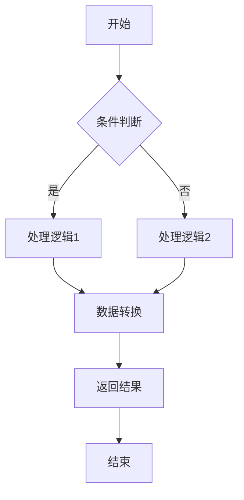
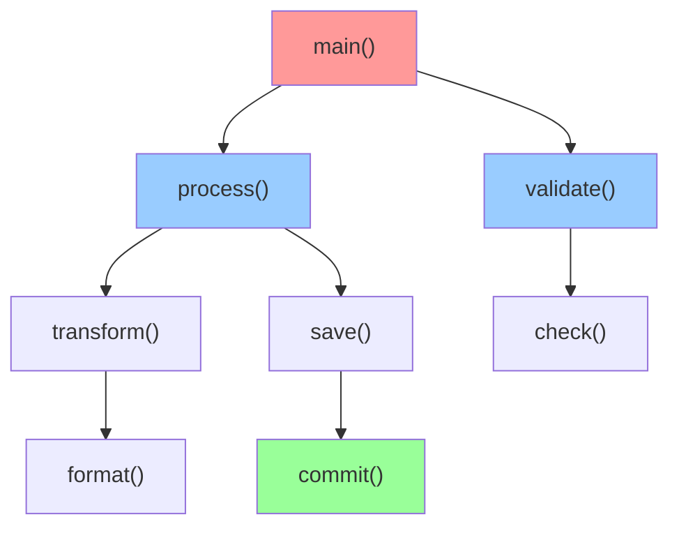
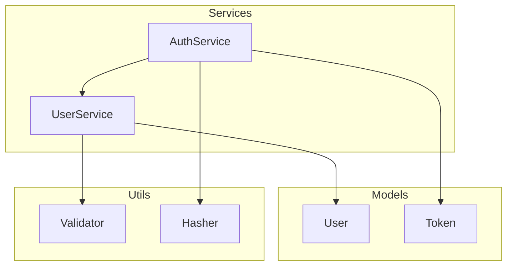

# 功能块深度分析

## 使用场景

当用户要求以下操作时，必须使用此skill：
- 分析某个功能块
- 深度分析某个模块
- 理解功能逻辑
- 生成功能流程图
- 分析调用关系
- 理解代码执行流程
- 分析功能块的出入口

## 功能块定义方式

### 方式1：文件路径
用户指定具体的文件路径
```
分析一下 src/utils/auth.py 这个模块
深度分析 components/UserProfile.tsx
```

### 方式2：文件路径范围
用户指定目录或文件范围
```
分析 src/services 目录下的功能块
```

### 方式3：自定义模块引用
用户指定可被import的模块名
```
分析 myapp.auth 模块
深度分析 utils.validators
```

### 方式4：功能描述
用户用功能描述来指定分析范围
```
分析"用户登录"功能块
深度分析"支付流程"功能
```

## 分析工作流程

### 第一步：确认分析范围
1. 根据用户输入确定功能块的具体边界
2. 识别主入口文件/函数
3. 确认分析深度和边界

### 第二步：代码扫描和映射
1. 扫描指定范围内的所有代码
2. 识别所有函数、类、方法定义
3. 标记所有函数调用和依赖关系
4. 标记所有import语句（但不深度分析被import的模块内部）

### 第三步：构建调用关系图
1. 建立函数/方法之间的调用链
2. 标记入口点（entry point）
3. 标记出口点（exit point）
4. 记录外部依赖（import关系）

### 第四步：生成流程分析
1. 追踪主要执行流程
2. 识别条件分支和循环
3. 分析数据流向
4. 标记关键决策点

### 第五步：生成可视化和报告
1. 生成Mermaid流程图
2. 生成调用关系图
3. 输出结构化报告
4. 列出所有外部依赖

## 分析输出格式

### 报告结构

```markdown
# 功能块深度分析报告

## 📋 基本信息
- 功能块名称
- 范围
- 文件数量
- 函数/方法数量
- 代码行数

## 🎯 功能概述
对功能块的整体功能进行简要描述

## 📊 入出口分析

### 入口点 (Entry Points)
| 入口 | 位置 | 说明 |
|-----|------|------|
| ... | ... | ... |

### 出口点 (Exit Points)
| 出口 | 返回值 | 说明 |
|-----|--------|------|
| ... | ... | ... |

## 🔄 执行流程图

使用Mermaid flowchart表示主要执行流程

## 🔗 调用关系图

使用Mermaid graph表示函数/方法调用关系

## 📦 依赖分析

### 外部导入 (External Imports)
| 模块 | 位置 | 用途 |
|-----|------|------|
| ... | ... | ... |

### 内部引用 (Internal References)
列出内部各文件/模块之间的引用关系

## 📝 详细分析

### 核心函数/方法分析
对关键函数进行详细分析：
- 函数签名
- 功能描述
- 参数说明
- 返回值
- 调用它的函数
- 它调用的函数

### 数据流分析
追踪关键数据的流向

### 条件分支分析
列出所有条件分支和循环

## 🎬 执行流程步骤
按顺序列出功能块的执行步骤

## 🔍 关键发现
- 优点
- 潜在问题
- 改进建议
```

## 可视化示例

### 示例1：执行流程图 (Flowchart)



### 示例2：调用关系图 (Call Graph)



### 示例3：类关系图



## 分析示例

### 示例1：Python功能块分析

```markdown
# 功能块深度分析报告：用户认证模块

## 📋 基本信息
- 功能块名称：User Authentication Module
- 范围：`src/services/auth.py`
- 文件数量：1
- 函数数量：8
- 代码行数：245

## 🎯 功能概述
用户认证模块负责处理用户登录、注册、token验证等认证相关的核心业务逻辑。包括密码哈希、token生成与验证、会话管理等功能。

## 📊 入出口分析

### 入口点 (Entry Points)
| 入口 | 位置 | 说明 |
|-----|------|------|
| login() | auth.py:25 | 用户登录入口 |
| register() | auth.py:45 | 用户注册入口 |
| verify_token() | auth.py:65 | token验证入口 |
| refresh_token() | auth.py:85 | token刷新入口 |

### 出口点 (Exit Points)
| 出口 | 返回值 | 说明 |
|-----|--------|------|
| login() | AuthResponse | 返回token和用户信息 |
| register() | User | 返回新创建的用户 |
| verify_token() | bool | 返回token有效性 |
| refresh_token() | Token | 返回新token |

## 🔄 执行流程图

### login() 登录流程

\`\`\`mermaid
flowchart TD
    A["login(email, password)"] --> B{"用户存在?"}
    B -->|否| C["抛出异常"]
    B -->|是| D["验证密码"]
    D --> E{"密码正确?"}
    E -->|否| F["抛出异常"]
    E -->|是| G["生成token"]
    G --> H["记录登录日志"]
    H --> I["返回AuthResponse"]
    C --> J["结束"]
    F --> J
    I --> J
\`\`\`

### token验证流程

\`\`\`mermaid
flowchart TD
    A["verify_token(token)"] --> B["解析token"]
    B --> C{"格式有效?"}
    C -->|否| D["返回False"]
    C -->|是| E["检查过期时间"]
    E --> F{"已过期?"}
    F -->|是| G["返回False"]
    F -->|否| H["验证签名"]
    H --> I{"签名正确?"}
    I -->|否| J["返回False"]
    I -->|是| K["返回True"]
    D --> L["结束"]
    G --> L
    J --> L
    K --> L
\`\`\`

## 🔗 调用关系图

\`\`\`mermaid
graph TD
    A["login()"] --> B["find_user()"]
    A --> C["verify_password()"]
    A --> D["generate_token()"]
    A --> E["log_login()"]
    
    F["register()"] --> G["validate_email()"]
    F --> H["hash_password()"]
    F --> I["create_user()"]
    
    J["verify_token()"] --> K["parse_jwt()"]
    J --> L["check_expiry()"]
    J --> M["verify_signature()"]
    
    N["refresh_token()"] --> O["verify_token()"]
    N --> D
    
    style A fill:#ff9999
    style F fill:#ff9999
    style J fill:#ff9999
    style N fill:#ff9999
    style D fill:#99ff99
    style I fill:#99ff99
    
\`\`\`

## 📦 依赖分析

### 外部导入 (External Imports)
| 模块 | 位置 | 用途 |
|-----|------|------|
| jwt | auth.py:1 | JWT token生成和验证 |
| hashlib | auth.py:2 | 密码哈希 |
| datetime | auth.py:3 | 时间戳和过期时间检查 |
| sqlalchemy | auth.py:4 | 数据库查询 |

### 内部引用 (Internal References)
- models.User：用户模型
- models.Token：token模型
- config.SECRET_KEY：密钥配置
- config.TOKEN_EXPIRY：token过期时间配置

## 📝 详细分析

### 核心函数分析

#### 1. login(email: str, password: str) -> AuthResponse
**位置**：auth.py:25-42
**功能**：处理用户登录
**流程**：
  1. 根据email查找用户
  2. 验证密码
  3. 生成访问token
  4. 记录登录日志
  5. 返回认证响应

**调用关系**：
  - 调用：find_user()、verify_password()、generate_token()、log_login()
  - 被调用：api/auth.py中的login_handler()

#### 2. generate_token(user_id: int, expires_in: int = 3600) -> str
**位置**：auth.py:130-145
**功能**：生成JWT token
**参数**：
  - user_id: 用户ID
  - expires_in: 过期时间（秒），默认1小时

**返回值**：JWT token字符串

#### 3. verify_token(token: str) -> bool
**位置**：auth.py:65-82
**功能**：验证token有效性
**流程**：
  1. 解析JWT
  2. 检查过期时间
  3. 验证签名
  4. 返回有效性

### 数据流分析

**用户登录数据流**：
```
email & password 
    ↓
验证用户存在性
    ↓
密码验证
    ↓
生成token (包含user_id, 时间戳)
    ↓
返回 {token, user_info}
    ↓
客户端存储token
```

**token验证数据流**：
```
token字符串
    ↓
解析JWT payload
    ↓
提取user_id, exp_time
    ↓
检查是否过期
    ↓
验证HMAC签名
    ↓
返回验证结果
```

## 🎬 执行流程步骤

### 完整登录流程（从用户请求到返回响应）

1. **客户端发送请求**：POST /api/auth/login {email, password}
2. **入口函数调用**：login(email, password)
3. **数据库查询**：find_user(email)
4. **密码验证**：verify_password(input_password, stored_hash)
5. **token生成**：generate_token(user.id)
6. **日志记录**：log_login(user.id, timestamp)
7. **响应构建**：AuthResponse(token, user_info)
8. **返回客户端**：HTTP 200 + token

## 🔍 关键发现

### ✅ 优点
- 使用JWT进行无状态认证，可扩展性好
- 密码采用hash加密存储，安全性高
- token包含过期时间，防止长期有效
- 有登录日志记录，便于审计

### ⚠️ 潜在问题
- 未实现token黑名单机制，无法主动登出
- 密码复杂度验证可能不足（register函数中）
- 缺少速率限制，容易被暴力破解
- token刷新没有旋转策略

### 💡 改进建议
1. **添加token黑名单**：记录已登出的token，防止使用
2. **强化密码验证**：register时检查密码复杂度
3. **添加速率限制**：限制失败登录尝试次数
4. **实现token旋转**：刷新token时返回新token，旧token失效
5. **添加多因素认证**：支持2FA增强安全性
6. **记录更详细的日志**：记录登录IP、设备信息等

```

### 示例2：JavaScript功能块分析

```markdown
# 功能块深度分析报告：用户列表管理

## 📋 基本信息
- 功能块名称：User List Management
- 范围：`components/UserList/` 目录
- 文件数量：3 (UserList.tsx, useUserList.ts, UserTable.tsx)
- 函数数量：12
- 代码行数：580

## 🎯 功能概述
用户列表管理功能块提供用户列表的展示、筛选、搜索、分页、编辑、删除等完整的CRUD操作。包括数据加载、状态管理、UI渲染等功能。

## 📊 入出口分析

### 入口点 (Entry Points)
| 入口 | 位置 | 说明 |
|-----|------|------|
| UserList | UserList.tsx:1 | React组件导出 |
| useUserList | useUserList.ts:1 | 自定义Hook |

### 出口点 (Exit Points)
| 出口 | 返回值 | 说明 |
|-----|--------|------|
| UserList | JSX.Element | 渲染的组件 |
| useUserList() | {users, loading, ...} | 列表数据和操作 |

## 🔄 执行流程图

### 组件初始化和数据加载流程

\`\`\`mermaid
flowchart TD
    A["UserList挂载"] --> B["useUserList hook初始化"]
    B --> C["设置初始状态"]
    C --> D["useEffect触发"]
    D --> E["调用fetchUsers()"]
    E --> F["设置loading=true"]
    F --> G["发送API请求"]
    G --> H{"请求成功?"}
    H -->|否| I["设置error状态"]
    H -->|是| J["处理响应数据"]
    J --> K["分页处理"]
    K --> L["设置users状态"]
    L --> M["设置loading=false"]
    I --> N["组件重新渲染"]
    M --> N
\`\`\`

## 🔗 调用关系图

\`\`\`mermaid
graph TD
    A["UserList"] --> B["useUserList()"]
    A --> C["UserTable"]
    A --> D["SearchBar"]
    A --> E["Pagination"]
    
    B --> F["fetchUsers()"]
    B --> G["handleDelete()"]
    B --> H["handleEdit()"]
    B --> I["handleSearch()"]
    B --> J["handlePageChange()"]
    
    F --> K["userService.getUsers()"]
    G --> L["userService.deleteUser()"]
    H --> M["userService.updateUser()"]
    
    C --> N["UserRow组件"]
    N --> O["EditButton"]
    N --> P["DeleteButton"]
    
    style A fill:#ff9999
    style B fill:#ffcc99
    style F fill:#99ccff
    style K fill:#99ff99
\`\`\`

## 📦 依赖分析

### 外部导入 (External Imports)
| 模块 | 位置 | 用途 |
|-----|------|------|
| react | UserList.tsx:1 | React框架 |
| @tanstack/react-query | useUserList.ts:1 | 数据获取和缓存 |
| axios | api/userService.ts:1 | HTTP请求 |
| antd | components:* | UI组件库 |

### 内部引用 (Internal References)
- useUserList hook
- UserTable 子组件
- userService API服务
- types/User 类型定义

## 📝 详细分析

### 核心函数分析

#### 1. UserList 组件
**位置**：UserList.tsx:15-120
**功能**：用户列表主组件
**主要逻辑**：
  - 使用useUserList hook获取数据
  - 渲染搜索栏、表格、分页器
  - 处理用户交互事件

#### 2. useUserList() Hook
**位置**：useUserList.ts:1-150
**功能**：管理用户列表的状态和逻辑
**返回值**：
  - users: 用户列表
  - loading: 加载状态
  - error: 错误信息
  - pagination: 分页信息
  - 操作函数

#### 3. fetchUsers() 
**位置**：useUserList.ts:30-50
**功能**：获取用户列表
**流程**：
  1. 设置loading状态
  2. 调用API获取数据
  3. 处理分页
  4. 更新状态

## 🎬 执行流程步骤

1. **组件挂载**：UserList组件首次渲染
2. **Hook初始化**：useUserList hook执行初始化
3. **状态设置**：设置loading、users、pagination初始状态
4. **Effect执行**：useEffect中的依赖满足，执行数据加载
5. **API调用**：fetchUsers发起请求
6. **数据处理**：接收响应，处理分页
7. **状态更新**：更新users和pagination
8. **组件重新渲染**：使用新数据渲染UI
9. **用户交互**：搜索、分页、编辑、删除等操作
10. **反馈更新**：操作成功后更新列表

## 🔍 关键发现

### ✅ 优点
- 使用hook分离数据逻辑和UI逻辑
- 合理利用react-query处理缓存
- 组件拆分清晰，易于维护

### ⚠️ 潜在问题
- 缺少乐观更新，用户体验不佳
- 无重复请求去重机制
- 错误处理不够完善
- 大列表性能可能有问题

### 💡 改进建议
1. 实现乐观更新
2. 添加请求去重
3. 完善错误处理和重试机制
4. 对大列表使用虚拟滚动
5. 添加加载骨架屏
```

## 实施建议

### 分析时的关键点

1. **确认范围边界**
   - 明确哪些文件/函数在分析范围内
   - 识别外部依赖（import）但不深度分析
   - 清楚标注范围外的引用

2. **追踪执行流程**
   - 从入口函数开始逐步追踪
   - 标记所有条件分支
   - 记录所有函数调用链

3. **可视化呈现**
   - 使用Mermaid流程图表示执行流程
   - 使用调用关系图表示依赖关系
   - 清晰标注入出口

4. **详细文档**
   - 对关键函数逐一分析
   - 追踪重要数据的流向
   - 列举潜在问题和改进建议

### 输出检查清单

- [ ] 功能块范围清晰
- [ ] 入出口完整列出
- [ ] 执行流程图准确
- [ ] 调用关系图完整
- [ ] 外部依赖标注清楚
- [ ] 核心函数有详细分析
- [ ] 数据流向追踪清晰
- [ ] 有关键发现和建议
- [ ] 所有代码位置都有准确定位（文件:行号）

## 输出格式规范

1. 使用Markdown格式编写
2. 使用Mermaid生成流程图和关系图
3. 精确定位代码位置（文件:行号）
4. 使用表格整理结构化信息
5. 清晰标注入出口、依赖关系
6. 提供具体的改进建议
